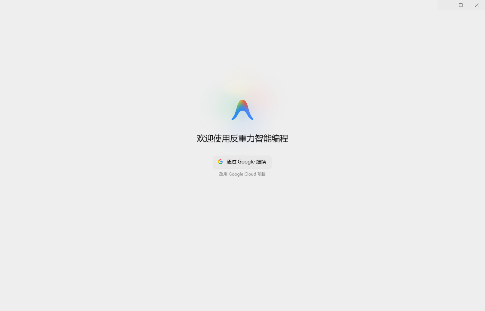
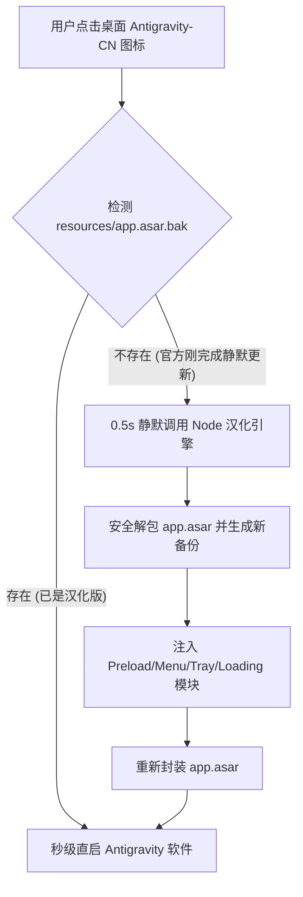

# 🚀 Antigravity Auto-Localizer (反重力智能中文增强引擎)

<div align="center">

[](LICENSE)
[]()
[]()
[]()
[]()

**专为 Google Antigravity 打造的新一代全自动、无损、无感更新中文本地化系统**

[简体中文](README.md) • [繁體中文](README_TW.md) • [问题反馈](https://github.com/TaoCosmo-Dev/antigravity-cn/issues)

</div>

---

## 🌟 为什么选择本项目？

市面上的传统外挂式汉化包存在两大致命痛点：**“官方每次更新就变回英文，需要手动重新解压注入”** 以及 **“代码区容易被误翻译污染”**。

本项目从底层架构出发，彻底重构了汉化注入方案：

| 功能维度 | 传统汉化包 | 🚀 本项目 (Antigravity Auto-Localizer) |
| :--- | :--- | :--- |
| **官方更新支持** | ❌ 每次更新后全部失效，需手动重新操作 | ✅ **首创无感守护启动器**，检测到更新 0.5s 静默自愈注入 |
| **设置与二级页面** | ⚠️ 仅汉化一级菜单，深层设置大面积遗漏 | ✅ **100% 全深度覆盖**（含远程控制、执行策略、MCP、思考链） |
| **代码/终端安全性** | ⚠️ 容易误伤代码、终端输出或大模型原始提示词 | ✅ **12 层 DOM 向上回溯物理隔离**，绝对不触碰代码与模型交互 |
| **安装便利度** | ⚠️ 步骤繁琐，需手动配环境或依赖 Python | ✅ **双击即用**，纯 Node.js 极速执行，自动生成桌面专用图标 |
| **还原与安全性** | ❌ 破坏原包或无法完全还原 | ✅ **每次注入前自动备份**，提供秒级一键无损还原 |

---

## 📸 汉化效果一览

<div align="center">
  <table>
    <tr>
      <td align="center"><b>欢迎与登录引导</b></td>
      <td align="center"><b>主编辑器与工作区</b></td>
    </tr>
    <tr>
      <td></td>
      <td></td>
    </tr>
    <tr>
      <td align="center" colspan="2"><b>全深度设置面板（全模块汉化）</b></td>
    </tr>
    <tr>
      <td align="center" colspan="2"></td>
    </tr>
  </table>
</div>

---

## 🚀 10 秒极速安装指南

### 步骤 1：下载仓库代码

```bash
git clone https://github.com/TaoCosmo-Dev/antigravity-cn.git
```
*(或直接点击页面右上角绿色的 **Code -> Download ZIP** 下载并解压)*

### 步骤 2：一键配置自动更新守护（推荐）

进入项目文件夹：
* **Windows 用户**：直接双击运行 **`一键生成自动汉化启动器.bat`**；
* **macOS 用户**：双击运行 **`双击安装中文汉化.command`**。

> 💡 **完成！** 
> 桌面将自动生成 **`Antigravity-CN`** 快捷方式。以后直接从桌面图标启动即可，官方后台无论自动更新多少次，启动时都会**自动保持中文**！

---

## 🏗️ 核心架构与黑科技原理



### 1. 自动更新守护引擎 (`antigravity_smart_launcher.vbs`)
利用轻量守护脚本监听 Electron 的归档校验状态。当官方静默推送新版本并重置 `app.asar` 时，启动器在打开软件前毫秒级自动重放补丁，彻底实现**一次配置，终身免维护**。

### 2. 12 层 DOM 物理禁区隔离算法
```javascript
// 核心隔离逻辑：向上回溯 12 层 DOM 容器，识别并阻断代码区
const BLOCKED_CLASSES = [
    'monaco-editor', 'editor-container', 'terminal', 
    'output-view', 'debug-console', 'chat-bubble', 'chat-msg'
];
```
引擎自动向上递归判定容器归属。编辑器代码、终端命令输出、对话输入框以及大模型原始推理文本均处于“绝对禁区”，确保 AI 接收到的指令与产出的代码**零污染**。

---

## 📂 仓库目录结构

```
antigravity-cn/
├── 🚀 一键生成自动汉化启动器.bat   # Windows 推荐入口 (配置自动更新守护并生成桌面图标)
├── ⚡ 双击安装中文汉化.bat        # Windows 传统单次汉化入口
├── 🍏 双击安装中文汉化.command    # macOS 一键汉化入口
├── 🔄 双击卸载还原官方英文.bat    # Windows 一键无损还原官方原版
├── 🛡️ antigravity_smart_launcher.vbs # 自动更新无感守护脚本
├── 🧠 localization_engine.js      # 核心 ASAR 解包注入与 DOM 隔离引擎
├── 📁 dicts/                      # 简体中文全量模块化字典
│   ├── common.json                # 通用 UI、工作区、对话控制
│   ├── page_settings.json         # 详细参数、远程控制、执行策略、MCP 配置
│   ├── page_mcp_knowledge.json    # MCP 服务器与知识库
│   ├── page_agents.json           # 智能体管理器与规则策略
│   └── menu_nav.json              # 顶部系统菜单与导航栏
├── 📁 dicts_tw/                   # 繁體中文全量模組化字典
└── 📄 README.md                   # 官方说明文档
```

---

## 🛠️ 高级命令行用法

如果你是开发者或希望通过终端自定义安装：

```bash
# 1. 默认安装（左上角保留官方 Antigravity 英文品牌名）
node localization_engine.js --brand-title english

# 2. 隐藏左上角品牌文字
node localization_engine.js --brand-title hidden

# 3. 显示中文品牌名（“反重力智能编程”）
node localization_engine.js --brand-title translated

# 4. 安装繁体中文版
node localization_engine.js --tw

# 5. 一键还原官方原版英文
node localization_engine.js --huifu
```

---

## ❓ 常见问题 (FAQ)

<details>
<summary><b>Q1: 汉化后会影响大模型写代码的能力或英文提示词效果吗？</b></summary>
<b>完全不会。</b> 汉化引擎只拦截并替换视觉渲染层的 UI 控件文本。大模型接收到的所有上下文、系统提示词（Prompt）以及输出的代码文件均保持纯正原版传输。
</details>

<details>
<summary><b>Q2: 软件自动更新后需要重新下载汉化包吗？</b></summary>
<b>不需要！</b> 只要你使用的是桌面生成的 <code>Antigravity-CN</code> 启动图标，每次官方自动更新后，启动器会自动在 0.5 秒内静默打好最新补丁，完全不需要重新运行安装脚本。
</details>

<details>
<summary><b>Q3: 如何彻底卸载并恢复官方原版英文？</b></summary>
随时双击运行 <code>双击卸载还原官方英文.bat</code>（或执行 <code>node localization_engine.js --huifu</code>），程序会通过备份的 <code>app.asar.bak</code> 完美复原，绝不留任何残留。
</details>

---

## 🤝 参与贡献

欢迎提交 Issue 和 Pull Request！如果你在最新版本中发现了未翻译的新词条，欢迎修改 `dicts/*.json` 并提交 PR。

## 📄 开源许可证

本项目基于 [MIT License](LICENSE) 协议开源。
